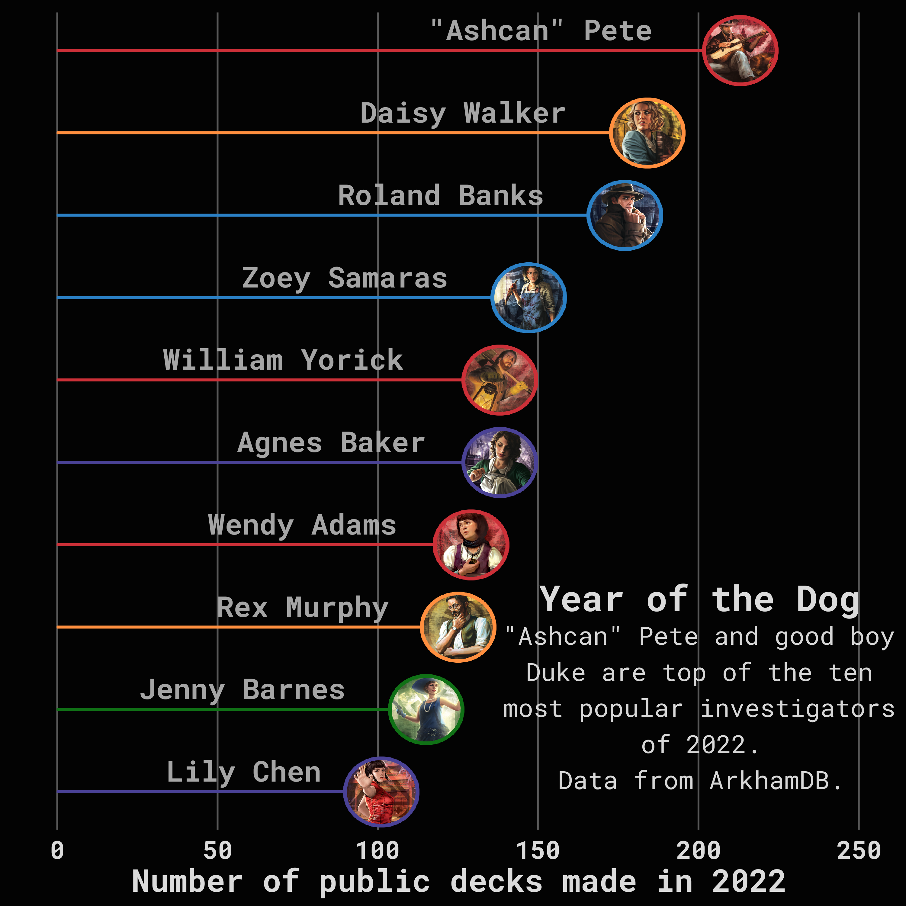

# TidyTuesday

## About

[TidyTuesday](https://github.com/rfordatascience/tidytuesday) is a weekly data project, which aims to promote data wrangling and visualisation skills. More from the `R4DS Online Learning Community`:

> Every week we post a raw dataset, a chart or article related to that dataset, and ask you to explore the data. While the dataset will be “tamed”, it will not always be tidy! As such you might need to apply various `R for Data Science` techniques to wrangle the data into a true tidy format. The goal of `TidyTuesday` is to apply your R skills, get feedback, explore other’s work, and connect with the greater `#RStats` community! As such we encourage everyone of all skills to participate! 

## Repository Structure

This repository is organised into years (e.g., [2023](2023)) and weeks (e.g., [week_01](2023/week_01/)) for each weekly challenge. Within the week folder, you can find code to wrangle and produce data visualisation, as well as the visualisations themselves.

## Some Examples

### **[The Investigators of Arkham Horror - The Key Pieces of a Collaborative Card Game (2023/week 1)](2023/week_01)**

